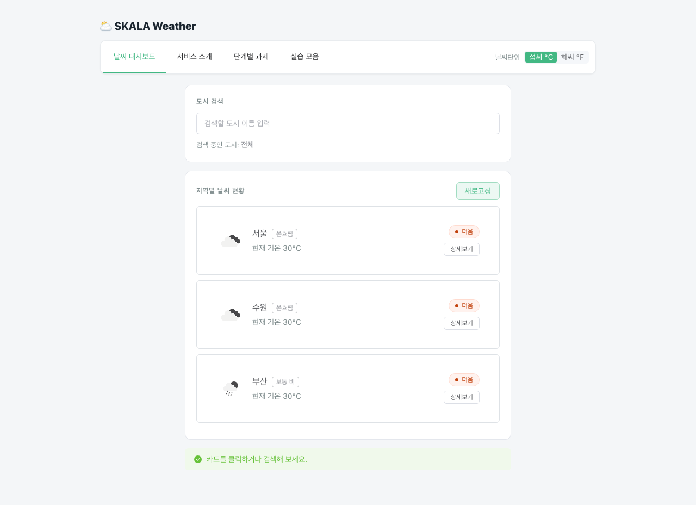
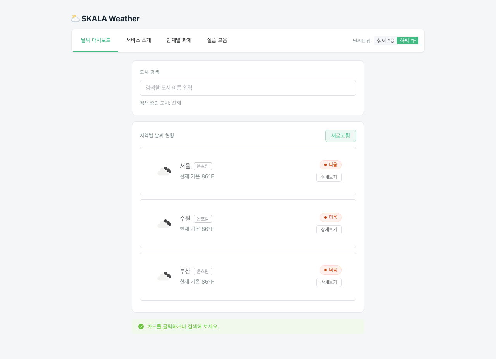
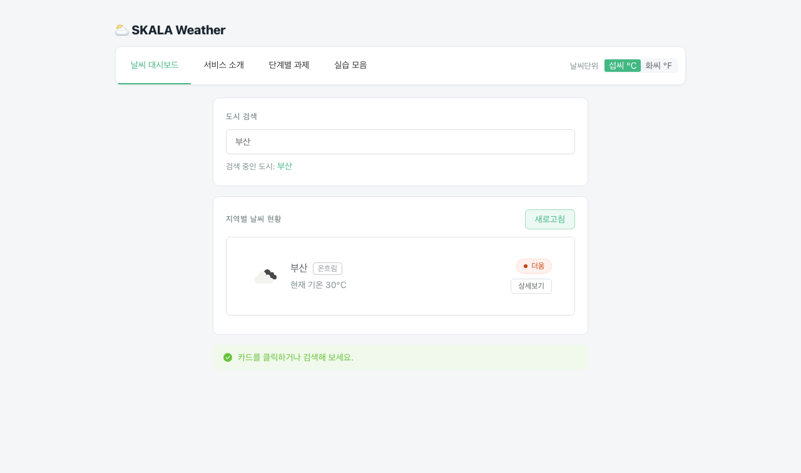
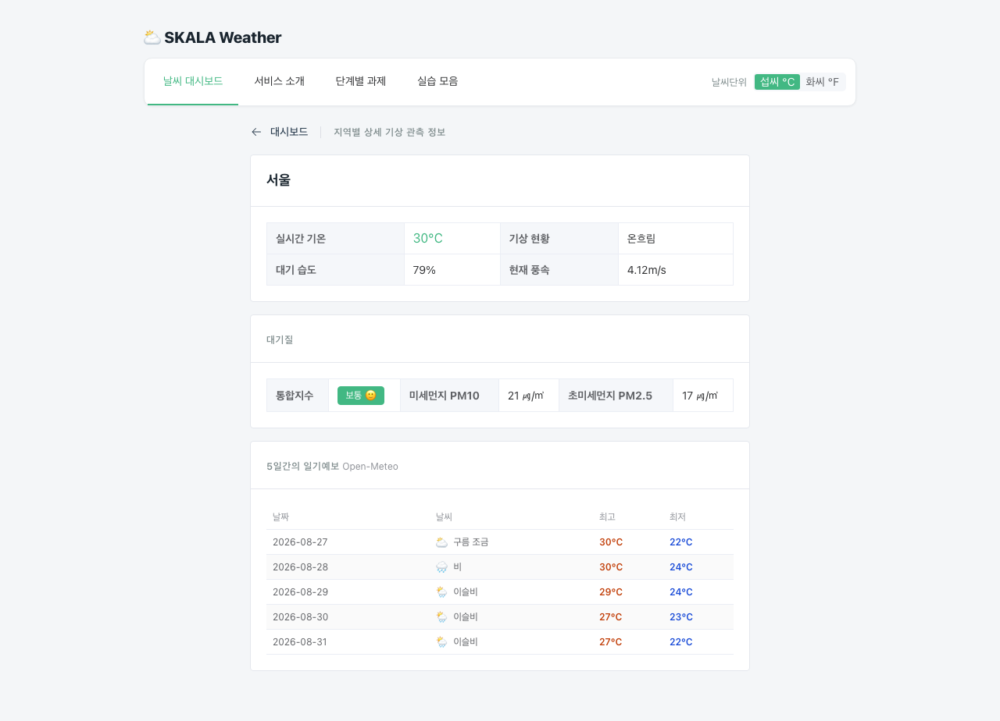
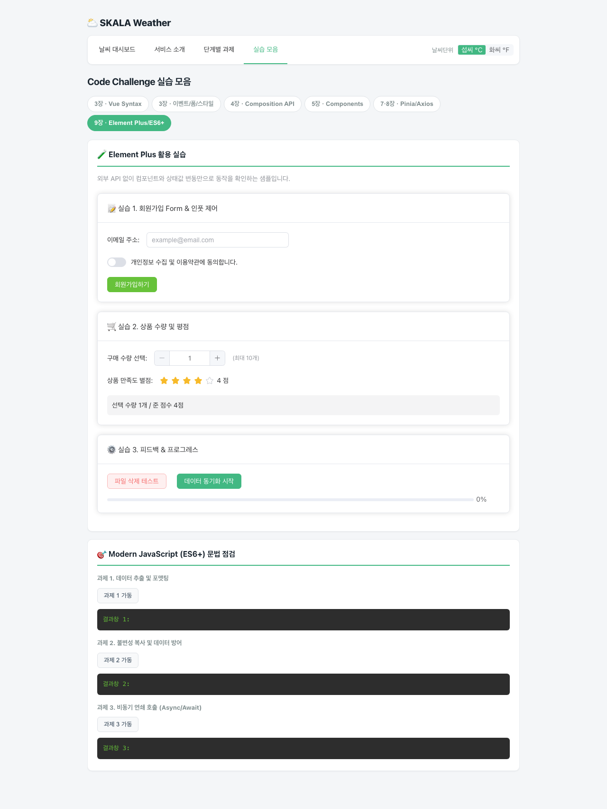
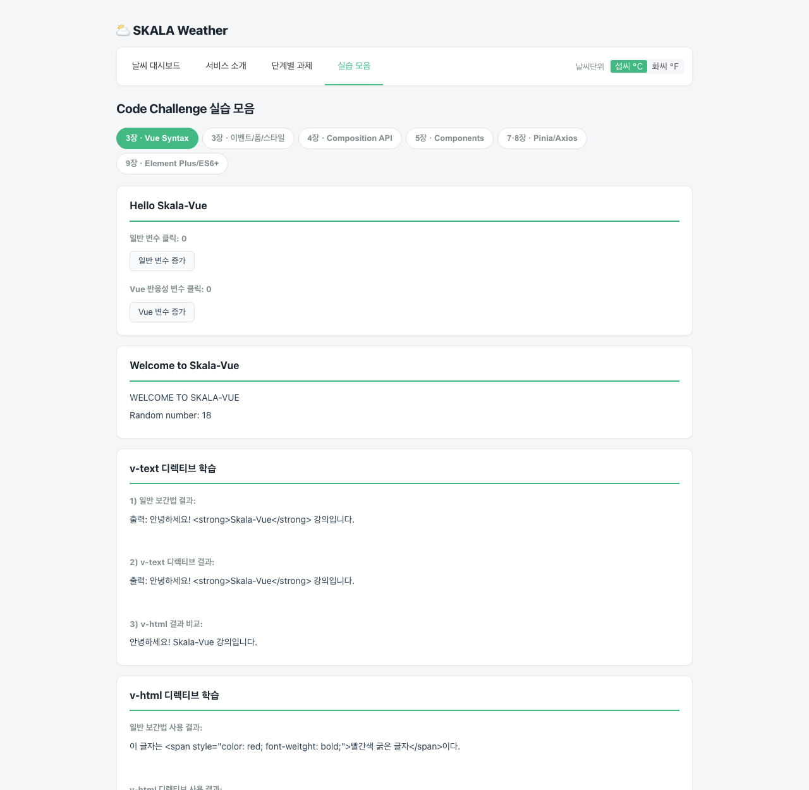
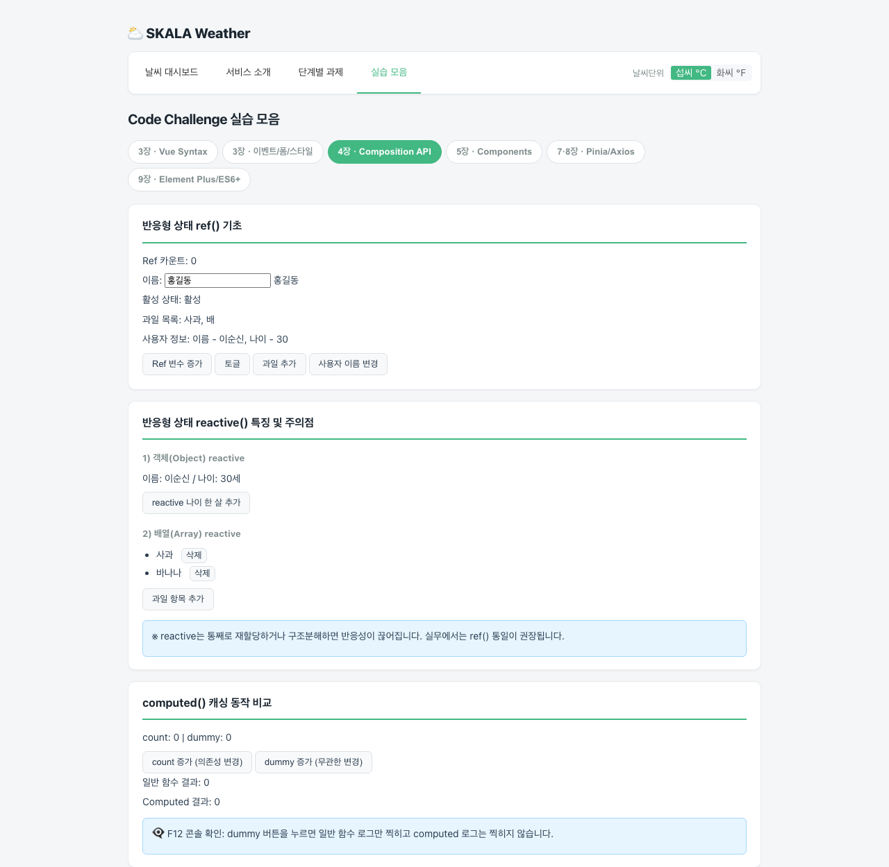
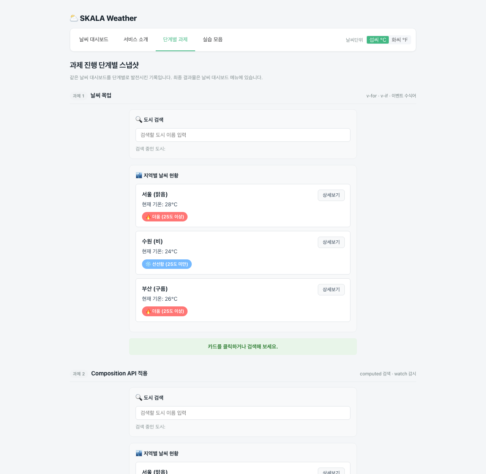
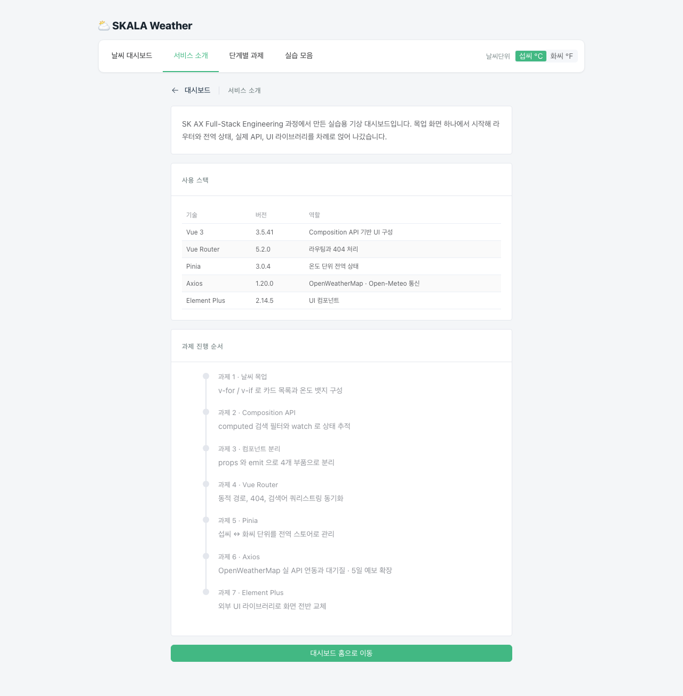
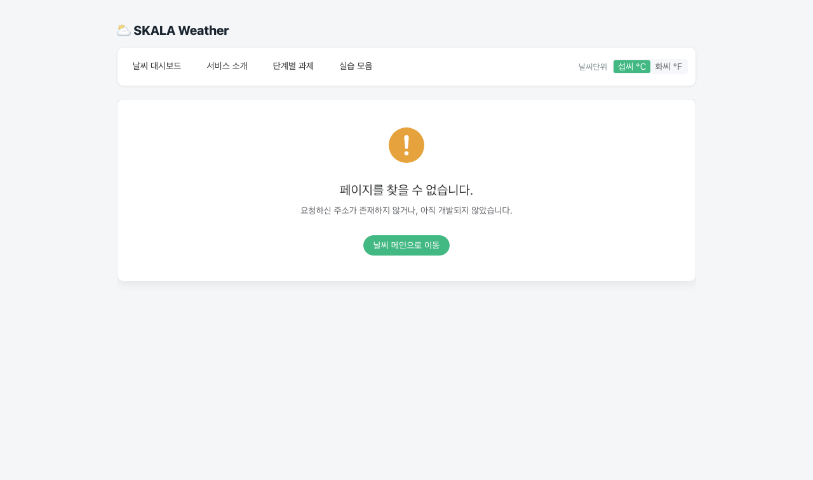

# ⛅ skala-vue

[](https://skala-front-three.vercel.app/)

SK AX Full-Stack Engineering 과정의 Vue.js 실습 프로젝트입니다.

날씨 대시보드 하나를 계속 고쳐 나가는 방식으로 진행했습니다. 처음엔 배열을 하드코딩한 목업이었고, 여기에 computed와 watch를 붙이고, 컴포넌트로 쪼개고, 라우터와 Pinia를 얹고, 마지막에 OpenWeatherMap 실 API로 갈아끼웠습니다. **단계별 결과물은 지우지 않고 남겨뒀기 때문에** 단계별 과제 메뉴에서 순서대로 비교해볼 수 있습니다.

## 사용 스택


| 기술              | 버전           | 프로젝트에서 맡은 역할               |
| ----------------- | -------------- | ------------------------------------ |
| Vue 3             | 3.5.41         | Composition API 기반 UI 구성         |
| Vue Router        | 5.2.0          | 페이지 라우팅, 동적 경로, 404 처리   |
| Pinia             | 3.0.4          | 온도 단위 전역 상태 관리             |
| Axios             | 1.20.0         | OpenWeatherMap / Open-Meteo API 통신 |
| Element Plus      | 2.14.5         | 날씨 앱 전반의 UI 컴포넌트           |
| Vite              | 8.2.2          | 개발 서버 및 번들링                  |
| ESLint · Prettier | 10.9.0 · 3.8.3 | 정적 검사와 코드 포맷                |

## 실행 방법

```bash
npm install
npm run dev
```

| 명령어                  | 하는 일                                      |
| ----------------------- | -------------------------------------------- |
| `npm run dev`           | 개발 서버 실행                               |
| `npm run build`         | 배포용 정적 파일 생성 (`--mode development`) |
| `npm run build:staging` | 스테이징 모드 빌드 (`.env.staging` 로드)     |
| `npm run build:prod`    | 운영 모드 빌드 (`.env.production` 로드)      |
| `npm run lint`          | Oxlint + ESLint 검사                         |
| `npm run format`        | Prettier 정렬                                |

## 🔑 API 키 설정

실제 날씨 데이터를 받아오려면 키가 필요합니다. 프로젝트 루트에 `.env.local` 파일을 만들고 OpenWeatherMap에서 발급받은 키를 넣어주세요.

```
VITE_WEATHER_API_KEY=여기에_키
```

몇 가지 주의할 점

- Vite는 **`VITE_` 로 시작하는 변수만** 클라이언트 코드로 넘겨줍니다. 이를 빼먹으면 `undefined`가 나옵니다.
- `.env.local`은 `.gitignore`의 `*.local` 규칙에 걸려서 저장소에 올라가지 않습니다.
- 키를 새로 발급했다면 활성화까지 시간이 걸립니다. **401이 뜬다고 키가 틀린 게 아닐 수 있으니** 조금 기다렸다가 다시 시도해보시기 바랍니다.

## 화면 구성

| 경로               | 내용                                                 |
| ------------------ | ---------------------------------------------------- |
| `/`                | 메인 대시보드. 도시를 검색하고 카드 목록을 봅니다    |
| `/weather/:cityId` | 도시 상세. 현재 날씨 + 미세먼지 + 5일간의 일기예보   |
| `/about`           | 서비스 소개                                          |
| `/steps`           | 과제 1~3 단계별 결과물                               |
| `/practice`        | Code Challenge 실습 모음. 챕터별 탭으로 나눠뒀습니다 |

정의되지 않은 주소로 들어가면 404 페이지가 뜹니다.

### 메인 대시보드



- 도시 카드는 `v-for` 로 그리고, 25도 기준으로 더움 · 선선함 뱃지가 갈림
- 로딩 중에는 `el-skeleton`, 실패하면 `el-alert` 로 상태를 나눠 표시
- 하단 상태바는 카드 클릭 이벤트(`select-card`)를 받아 갱신

### 온도 단위 전환 — Pinia



- 네비게이션 바의 `el-segmented` 를 누르면 전역 스토어의 `unit` 이 바뀜
- 토글 버튼과 카드는 사촌 관계라 props 로는 중간 컴포넌트가 배달만 하게 됨 → 스토어로 건너뜀
- **원본은 섭씨로 두고 표시 시점에만 변환** → 91°F 로 바뀌어도 더움 판정은 그대로

### 검색과 URL 동기화



- `computed` 로 목록을 걸러서 검색어가 바뀔 때만 재계산
- 검색어를 쿼리스트링에 반영 → 위 화면은 `/?search=수원` 으로 직접 접근한 결과
- 그대로 새로고침하거나 링크를 공유해도 검색 상태가 유지됨

### 도시 상세 — Axios



- 현재 날씨 → 대기질 · 일기예보 순으로 호출. 뒤 두 개는 서로 무관해서 `Promise.all` 로 동시에
- OpenWeatherMap(날씨 · 대기오염) 과 Open-Meteo(예보) 두 곳을 씀
- 대기질 등급에 따라 `el-tag` 색이 바뀌고, 예보는 `el-table` 로 날짜·날씨·최고·최저를 표시

### Code Challenge 실습 모음



- 챕터별 탭으로 39개 실습 컴포넌트를 한 페이지에 모음
- 위 화면은 9장 탭 — Element Plus 폼 · 수량 · 별점 · 프로그레스와 ES6+ 문법 점검

<details>
<summary>다른 탭 화면</summary>

**3장 · Vue Syntax**



**4장 · Composition API**



</details>

### 과제 단계별 결과물



- 과제 1~3 의 결과물을 지우지 않고 남겨서 한 화면에서 비교
- 과제 1·2 는 자체 완결이라 Element Plus 적용 전 모습 그대로

### 서비스 소개 · 404





- 소개 페이지는 `el-timeline` 으로 과제 진행 순서를 정리
- 없는 주소는 catch-all 라우트가 받아 `el-result` 로 안내

## 📁 폴더 구조

```
src/
├── main.js               앱 시작점. Pinia · Router · Element Plus 등록 후 #app에 붙임
├── App.vue               네비게이션 바 + RouterView
├── router/index.js       라우트 정의
├── stores/               Pinia 스토어
├── services/
│   └── weatherApi.js     axios 인스턴스와 API 호출 함수
├── components/
│   ├── exercise/         과제용 컴포넌트
│   └── practices/        Code Challenge 실습
│       ├── basic/            디렉티브, 이벤트, 폼, 스타일
│       ├── composition/      ref, reactive, computed, watch
│       ├── component/        lifecycle, props/emits, slot
│       └── library/          Pinia, Axios, Element Plus, ES6+ 문법
└── views/                라우터에 걸리는 페이지들
```

`views`와 `components`를 나눈 건 문법적인 차이가 있어서가 아닙니다. **라우터에 직접 매핑되는 것**과 **여기저기서 재사용되는 것**을 구분하려고 그렇게 했습니다.

## 과제별 구현 내용

### 과제 1 — 날씨 목업

**추가**

- `v-for` + `:key="item.id"` 로 날씨 카드 반복 렌더링
- `v-if` / `v-else` 로 25도 기준 더움·선선함 뱃지 분기
- 카드 클릭 시 하단 상태바 문구 갱신

**직접 구현**

- 검색창을 `v-model` 대신 `:value` + `@input` 으로 작성 (둘을 합친 게 `v-model` 이라는 걸 확인하려고)

**개선된 점**

- `:key` 에 인덱스 대신 고유 id 사용 → 항목 삭제 시 엉뚱한 DOM 이 재사용되는 문제 예방
- `@click.stop` 적용 → 상세보기 버튼 클릭이 카드 클릭까지 전파되던 문제 해결

### 과제 2 — Composition API

**추가**

- `computed` 기반 검색 필터 `filteredWeatherList`
- `watch` 로 상태바 문구 변경 추적
- `watchEffect` 로 검색어 자동 추적

**변경**

- 필터 결과를 `ref` 에 담고 검색어가 바뀔 때마다 수동 갱신하려던 방식 → `computed` 로 대체

**개선된 점**

- 의존하는 값이 바뀔 때만 재계산되고 결과가 캐싱됨
- 검색어를 갱신하는 별도 코드가 사라짐
- deep watch 는 이전 값 추적이 안 된다는 걸 확인하고, 이전 값이 필요한 곳은 속성 단위 감시로 처리

### 과제 3 — 컴포넌트 분리

**추가**

- `BaseDashboardCard` — 슬롯만 두고 테두리·여백 담당
- `SearchBar` — props 로 검색어 수신, `update-query` 이벤트 상향
- `WeatherCard` — props 로 도시 객체 수신, `select-card` / `click-detail` 상향

**변경**

- 한 파일에 있던 목업을 **기능 변경 없이** 4개 컴포넌트로 분리
- 상태 소유권을 `WeatherParent` 한 곳으로 집중

**개선된 점**

- 검색 박스와 리스트 박스의 중복 스타일 제거
- 여기서 쪼갠 컴포넌트를 과제 4 `WeatherHomeView` 에서 그대로 재사용
- 단방향 흐름이 잡혀서 데이터가 어디서 바뀌는지 추적하기 쉬워짐

### 과제 4 — Vue Router

**추가**

- 라우트 정의와 지연 로딩, catch-all 404 처리
- `/steps`(단계별 과제), `/practice`(실습 모음) 라우트 직접 설계
- 검색어와 URL 쿼리스트링 동기화

**변경**

- 상세보기의 `window.alert` → `router.push` 로 실제 페이지 이동

**개선된 점**

- 검색한 상태로 새로고침하거나 링크를 공유해도 검색어가 유지됨
- 없는 주소로 들어가도 빈 화면 대신 404 페이지가 뜸
- 자주 안 쓰는 페이지는 진입 시점에 받아오므로 첫 로딩이 가벼워짐

### 과제 5 — Pinia

**추가**

- `configStore` — state `unit`, getter `unitSymbol`, action `toggleUnit`
- 네비게이션 바에 `UnitToggler` 배치
- `displayTemp` computed 로 섭씨 ↔ 화씨 변환

**변경**

- props 로 단위를 내려보내려던 계획 → 전역 스토어로 전환

**개선된 점**

- 토글 버튼과 카드는 사촌 관계라 props 로는 중간 컴포넌트가 사용되지 않음에도 전달해야 했는데, 그 계층을 건너뜀
- **원본은 섭씨로 고정하고 표시 시점에만 변환** → 화씨 모드에서도 25도 뱃지 판정이 깨지지 않음
- 페이지를 이동해도 단위 설정이 유지됨

### 과제 6 — Axios

**추가**

- `axios.create` 인스턴스로 `appid` · `units` · `lang` 공통 파라미터 일원화
- `normalize()` 응답 정규화 계층
- 로딩·에러 상태와 `try-catch-finally` 처리
- 대기오염 API로 미세먼지 표시 (요구사항 2)
- Open-Meteo 연동으로 5일간의 일기예보 표시 — WMO 코드를 한글 날씨로 해석 (요구사항 3)

**변경**

- 하드코딩한 목업 배열 → 실제 API 응답
- 화면에서 쓸 데이터 모양을 컴포넌트가 아니라 서비스 계층에서 확정

**개선된 점**

- 응답을 한 번 번역해두니 **API 스키마가 바뀌어도 컴포넌트는 수정할 필요가 없음**
- `finally` 에 로딩 종료를 넣어서 에러가 나도 스피너가 멈춤
- 401 인지 타임아웃인지에 따라 다른 안내가 나감
- 서로 무관한 요청은 `Promise.all` 로 동시에 보내 상세 페이지 대기 시간 단축

### 과제 7 — UI Library (Element Plus)

**추가**

- `main.js` 에서 Element Plus 전역 등록 (`app.use` + 스타일시트 import)
- 네비게이션을 `el-menu` 의 `router` 모드로 교체 — `index` 가 곧 이동할 주소
- 로딩은 `el-skeleton`, 에러는 `el-alert`, 빈 결과는 `el-empty` 로 분리
- 상세 페이지에 `el-descriptions` · `el-table` · `el-page-header` 적용
- 404 페이지를 `el-result` 로 교체
- ES6+ 문법 점검용 `EcmaScript` 컴포넌트 (구조분해, 스프레드, 옵셔널 체이닝, async/await)

**변경**

- 직접 그리던 카드·버튼·뱃지 → `el-card` · `el-button` · `el-tag`
- 온도 단위 토글 버튼 → `el-segmented` (스토어에 토글 액션만 있어서 computed 의 setter 로 연결)
- 검색창의 `<input>` → `el-input` (`clearable` 로 지우기 버튼 확보)
- 서비스 소개 페이지를 `el-timeline` 기반 과제 진행 이력으로 재작성

**개선된 점**

- `--el-color-primary` 를 브랜드 컬러로 덮어써서 **라이브러리를 써도 기존 색 정체성이 유지됨**
- 로딩 중 빈 화면 대신 회색 골격이 떠서 화면이 덜컹거리지 않음
- `stock` 이 `0` 일 때 `||` 를 쓰면 기본값으로 덮인다는 걸 확인하고 **`??` 로 처리** → 0 이 유효한 값으로 살아남음
- `/steps` 의 과제 1·2 결과물은 그대로 둬서 **적용 전후를 나란히 비교**할 수 있음

### 과제 8 — 품질 관리와 배포

**추가**

- ESLint 커스텀 규칙 — `eqeqeq: ['error', 'always']`, `no-console: 'off'`
- `.env.staging` / `.env.production` 과 `build:staging` · `build:prod` 스크립트
- `vercel.json` — 빌드 명령, 산출물 경로, SPA rewrite 규칙

**변경**

- `createWebHistory()` → `createWebHistory(import.meta.env.BASE_URL)`
- 배포 빌드는 `npm run build` 대신 `build:prod` 사용 (`--mode development` 로는 `.env.production` 이 안 잡힘)

**개선된 점**

- 일부러 `if (userAge == 20)` 을 넣어 확인 → `eqeqeq` 에 걸려 빌드 전에 검출됨
- 모드에 따라 읽히는 `.env` 파일이 달라지는 것을 번들에서 확인 — staging 은 `api-stage`, production 은 `api-prod`, **`--mode development` 는 `.env.development` 가 없어 `undefined`**
- `/about` 을 직접 열거나 새로고침해도 rewrite 가 `index.html` 을 돌려줘서 화면이 유지됨

## 배포

**https://skala-front-three.vercel.app/**

| 항목             | 값                     |
| ---------------- | ---------------------- |
| Build Command    | `npm run build:prod`   |
| Output Directory | `dist`                 |
| 환경 변수        | `VITE_WEATHER_API_KEY` |

**Vercel 연동**

- `main` 에 푸시할 때마다 자동 재배포
- 빌드 설정은 대시보드가 아니라 `vercel.json` 에 두어 저장소만 봐도 파악되게 함

**Build Command 를 따로 지정한 이유**

- Vercel 기본값인 `npm run build` 는 `--mode development` → `.env.production` 을 읽지 않음
- 배포본에는 운영 설정이 들어가야 해서 `build:prod` 로 고정

**SPA rewrite 가 필요한 이유**

- 서버에 실제로 존재하는 HTML 은 `index.html` 하나뿐
- `/about` 을 주소창에 직접 입력하거나 그 페이지에서 새로고침 → 서버가 해당 경로의 파일을 못 찾아 404
- rewrite 로 모든 요청을 `index.html` 로 넘김 → 앱이 먼저 뜨고 라우터가 주소를 읽어 화면을 그림
- 정적 파일은 rewrite 보다 우선 처리 → `/assets/**` 는 영향 없음

**API 키 주의**

- Vite 는 `VITE_` 로 시작하는 변수를 **빌드 시점에 번들 안으로 그대로 써넣음**
- 저장소에는 올라가지 않지만 배포된 JS 파일을 열면 노출됨
- 브라우저에서 도는 앱이라 구조상 피하기 어려움 → 채점 후 키 폐기 예정

## 개선하면 좋을 부분

온도 변환 로직이 `WeatherCard`와 `WeatherDetailView` 두 군데에 거의 똑같이 들어가 있습니다. 예보에도 단위 변환을 적용하려면 세 번째 중복이 생깁니다.
**composable로 빼면 깔끔해질 것 같습니다.**

컴포넌트들이 전부 밝은 배경을 기준으로 짜여 있어서, 스캐폴딩에 딸려오던 `prefers-color-scheme` 설정을 꺼두고 라이트 테마로 통일했습니다.
**다크모드 변경 기능도 추가하면 좋아 보입니다.**

Element Plus를 전역 등록해서 쓰다 보니 사용하지 않는 컴포넌트까지 전부 번들에 들어갑니다.
**필요한 것만 개별 import 하거나 자동 import 플러그인을 쓰면 줄어들 것으로 보입니다.**
